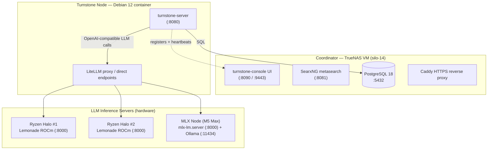

# Turnstone Bare-Metal & TrueNAS Coordinator Migration Guide

This directory contains the complete deployment and migration tooling for transitioning Turnstone from a single-host Docker Compose setup to a distributed, multi-node infrastructure.

> **Architecture change (2026-08):** The hardware LLM nodes are now **inference-only** servers. The Turnstone node role has been extracted into a dedicated **Debian 12 container** that registers with the Coordinator and proxies LLM traffic to the hardware nodes.

---

## Cluster Architecture



### Participants

| Participant | Role | Deployed by |
|-------------|------|-------------|
| **Ryzen Nodes** (`ryzen-halo-1`, `ryzen-halo-2`) | **LLM Inference servers** — run Lemonade ROCm model servers behind a local `:8000/v1` endpoint, with `ryzenadj` TDP control. No Turnstone node is installed here. | `deploy_ryzen_node.sh` |
| **MLX Node** (`mbp-ai-core`) | **LLM Inference server** — runs `mlx-lm.server` (`:8000`) plus an Ollama engine (`:11434`) behind macOS `launchd`. No Turnstone node is installed here. | `deploy_mlx_node.sh` |
| **Debian 12 Container** | **Turnstone Node** — runs `turnstone-server` (`:8080`), registers with the Coordinator, connects to PostgreSQL, and proxies LLM traffic to the inference servers. Runs as a foreground container process (or a systemd unit when PID-1 systemd is present). | `deploy_turnstone_debian12.sh` |
| **Coordinator (TrueNAS VM)** | **Turnstone Coordinator** — `silo-14`: PostgreSQL 18, `turnstone-console` UI (`:8090`/`:9443`), Caddy HTTPS proxy, SearxNG metasearch (`:8081`). | `deploy_coordinator.sh` |

> [!NOTE]
> The inference servers expose standard OpenAI-compatible endpoints. The Turnstone node (Debian 12 container) is the only component that talks to PostgreSQL and the Coordinator console; the hardware nodes are dumb, fast inference endpoints.

---

## Script Inventory

| Script | Location | Host Target | Description |
|--------|----------|-------------|-------------|
| [`deploy_coordinator.sh`](deploy_coordinator.sh) | Coordinator | `silo-14` TrueNAS VM | Deploys PostgreSQL 18, Console UI, Caddy, Channel, and SearxNG containers. |
| [`install_postgres.sh`](install_postgres.sh) | Database Host | Debian VM / Host | Installs and configures PostgreSQL on a Debian VM for remote connections. |
| [`add_coordinator_user.sh`](add_coordinator_user.sh) | Database Host | Debian VM / Host | Provisions a new coordinator DB user (e.g. `turnstone-megamul`), grants shared `turnstone_app_group` DDL & migration privileges, and outputs a `.secret` file. |
| [`restore_postgres.sh`](restore_postgres.sh) | Migration | Database Host | Restores Turnstone PostgreSQL backup (.sql, .sql.gz, .dump) to an existing PostgreSQL database. |
| [`migrate_from_compose.sh`](migrate_from_compose.sh) | Migration | Local Host & `silo-14` | Exports database (19,944+ turns), Caddy CA root keys, and secrets (`--export`), then imports them onto `silo-14` (`--import`). |
| [`deploy_mlx_node.sh`](deploy_mlx_node.sh) | Inference Node | `mbp-ai-core.lan` (M5 Max) | Sets up Apple MLX (`mlx-lm.server`) + Ollama as `launchd` services and pulls models. Inference-only — no Turnstone node. |
| [`deploy_ryzen_node.sh`](deploy_ryzen_node.sh) | Inference Node | Ryzen Halo #1 & #2 (Linux) | Provisions `ryzenadj` TDP control and verifies the local Lemonade inference server. Inference-only — no Turnstone node. |
| [`deploy_turnstone_debian12.sh`](deploy_turnstone_debian12.sh) | Turnstone Node | Debian 12 container | Installs the full Turnstone node (user, venv + `turnstone` package, `/etc/turnstone/config.toml`, host-mounted `/workspace`, OpenSSH root login, Podman, Podman Compose, Homebrew) and runs `turnstone-server` as a foreground container process (or systemd unit when PID-1 systemd is present). |
| [`deploy_litellm_proxy.sh`](deploy_litellm_proxy.sh) | Load Balancer VM | Dedicated Proxy VM | Idempotently deploys LiteLLM proxy with least-busy routing across Ryzen and Apple Silicon nodes. |
| [`backup_turnstone.sh`](backup_turnstone.sh) | Backup Cron | `silo-14` TrueNAS VM | Runs daily compressed `pg_dump` of all conversation history, settings, and configs into TrueNAS ZFS dataset. |
| [`sync_repo.sh`](sync_repo.sh) | Cluster Sync | Cluster Nodes (`turnstone-postgres.lan`, `turnstone-coordinator-nerd-projects.lan`, `amd-ai-core-one.lan`, `amd-ai-core-two.lan`, `mbp-ai-core.lan`, `litellm-proxy.lan`) | Syncs local turnstone repo copy to LLM cluster nodes via rsync over passwordless SSH. |
| [`set_concurrency_limit.sh`](set_concurrency_limit.sh) | Cluster / Node Config | All Cluster Nodes / Local | Auto-detects installed inference engines and Turnstone configs, setting concurrency limits to 1. |
| [`install_ryzenadj.sh`](install_ryzenadj.sh) | Worker Node (Ryzen) | Ryzen Halo #1 & #2 (Linux) | Fetches, builds, and installs `ryzen_smu` DKMS driver, `ryzenadj`, and sets up `ryzen-tdp.service` systemd unit for persistent boot TDP limits. |


---

## Step-by-Step Migration Guide

### Phase 1: Deploy Coordinator VM on TrueNAS (`silo-14`)

1. Provision a Linux VM on TrueNAS `silo-14`:
   - **vCPUs**: 4
   - **RAM**: 10 GB
   - **Storage**: 200 GB NVMe
2. SSH into the `silo-14` VM and run the coordinator deployment script:
   ```bash
   sudo ./.github/issues/bare_metal_migration/deploy_coordinator.sh
   ```
3. Save the printed output credentials:
   - **JWT Secret**: `TURNSTONE_JWT_SECRET`
   - **Postgres Password**: `POSTGRES_PASSWORD`

---

### Choosing Your Migration Path (Mutually Exclusive)

There are two distinct migration and restoration paths. **Choose Path A or Path B based on your deployment topology — do NOT combine them:**

```
               ┌─────────────────────────────────────────────────────────┐
               │              Choose Your Migration Strategy             │
               └────────────┬───────────────────────────────┬────────────┘
                            │                               │
                            ▼                               ▼
       ┌────────────────────────────────────────┐ ┌────────────────────────────────────────┐
       │ Path A: Distributed / Dedicated DB     │ │ Path B: All-in-One Compose Migration   │
       │ (Recommended Multi-Node Topology)      │ │ (Single Standalone VM Bundle)          │
       ├────────────────────────────────────────┤ ├────────────────────────────────────────┤
       │ 1. deploy_coordinator.sh (silo-14 VM)  │ │ 1. migrate_from_compose.sh --export    │
       │ 2. restore_postgres.sh (DB Host/VM)    │ │    (Run on old Compose machine)        │
       │ 3. restart console (silo-14 VM)        │ │ 2. scp bundle to silo-14 VM            │
       │ 4. deploy_ryzen_node / deploy_mlx_node │ │ 3. migrate_from_compose.sh --import    │
       │    (inference nodes, on each hardware  │ │    (Imports DB, Caddy CA, and .env)    │
       │    box) + deploy_turnstone_debian12.sh │ │                                        │
       │    (Turnstone node, in a Debian 12     │ │                                        │
       │    container)                          │ │                                        │
       └────────────────────────────────────────┘ └────────────────────────────────────────┘
```

---

### Path A: Distributed Architecture & Dedicated Database (Recommended)

Use this path when running a distributed infrastructure with a dedicated central PostgreSQL instance (or embedded coordinator DB) and bare-metal LLM nodes:

#### Step 1: Deploy Coordinator VM on TrueNAS (`silo-14`)
1. SSH into the `silo-14` Coordinator VM and run:
   ```bash
   sudo ./.github/issues/bare_metal_migration/deploy_coordinator.sh
   ```
2. Note the generated credentials and PostgreSQL URL.

#### Step 2: Restore Database Backup (`restore_postgres.sh`)
Run `restore_postgres.sh` on the database host (`turnstone-postgres.lan`) or Coordinator VM:
```bash
./.github/issues/bare_metal_migration/restore_postgres.sh \
  -s .github/issues/bare_metal_migration/secrets/postgres_admin.secret \
  -f .github/issues/bare_metal_migration/db_backup/db/turnstone_db_20260815_130936.sql.gz
```
- **What it does**:
  - Automatically takes a safety backup (`existing_database_backup_${DATE}_${TIME}.sql.gz`).
  - Drops and recreates the `public` schema cleanly to prevent relation/constraint duplicate errors.
  - Imports all conversation history turns, workstreams, prompt templates, users, and tokens.
  - Reassigns table ownership to the application user (`turnstone-np` / `turnstone`).
  - Wipes stale 11-node container metadata so bare-metal nodes register freshly.

#### Step 3: Refresh Coordinator Console Connection Pool
Restart the console container on `silo-14` so its database connection pool binds cleanly to the newly restored schema:
```bash
sudo docker compose -f /opt/turnstone-coordinator/docker-compose.yml restart console
```

#### Step 4: Deploy LLM Inference Nodes (hardware)
Run the inference-node scripts on each hardware machine. These nodes serve LLM inference only — they do **not** install a Turnstone node:
```bash
# On AMD Ryzen AI Halo #1 (amd-ai-core-one.lan):
NODE_ID="ryzen-halo-1" sudo -E ./.github/issues/bare_metal_migration/deploy_ryzen_node.sh

# On AMD Ryzen AI Halo #2 (amd-ai-core-two.lan):
NODE_ID="ryzen-halo-2" sudo -E ./.github/issues/bare_metal_migration/deploy_ryzen_node.sh

# On Apple Silicon M5 Max (mbp-ai-core.lan):
./.github/issues/bare_metal_migration/deploy_mlx_node.sh
```

#### Step 5: Deploy the Turnstone Node (Debian 12 container)
Provision the dedicated Turnstone node in a fresh Debian 12 container. It registers with the Coordinator, connects to PostgreSQL, and proxies LLM traffic to the inference nodes:
```bash
# Inside / attached to a fresh Debian 12 container:
LLM_BASE_URL="http://litellm-proxy.lan:4000/v1" \
NODE_ID="turnstone-debian12" \
./.github/issues/bare_metal_migration/deploy_turnstone_debian12.sh

# Or as a container entrypoint (runs the server in the foreground):
docker run -d --name turnstone-node \
  -e LLM_BASE_URL=http://litellm-proxy.lan:4000/v1 \
  -e NODE_ID=turnstone-debian12 \
  -v /mnt/silo-14/ai-playground:/home/turnstone/silo-14.lan/ai-playground \
  debian:12 \
  bash -lc 'apt-get update && apt-get install -y bash curl ca-certificates && \
            bash /app/deploy_turnstone_debian12.sh'
```

---

### Path B: All-in-One Standalone Compose Migration (`migrate_from_compose.sh`)

Use this path only if you are migrating a standalone self-contained Docker Compose stack (including local Caddy CA root certificates, `.env` secrets, and database dump) onto a single all-in-one Coordinator VM:

1. **Export on Current Docker Compose Host**:
   ```bash
   ./.github/issues/bare_metal_migration/migrate_from_compose.sh --export
   ```
   *Output*: Creates a compressed migration bundle, e.g. `turnstone_migration_bundle_20260812_211111.tar.gz`.

2. **Transfer Bundle to `silo-14`**:
   ```bash
   scp turnstone_migration_bundle_*.tar.gz user@silo-14:/tmp/
   ```

3. **Import on Standalone Coordinator VM (`silo-14`)**:
   ```bash
   sudo ./.github/issues/bare_metal_migration/migrate_from_compose.sh --import /tmp/turnstone_migration_bundle_*.tar.gz
   ```
   *Output*: Restores environment secrets, Caddy CA keys, imports the database dump, and automatically purges old compose container node metadata.

> [!NOTE]
> Do not execute `migrate_from_compose.sh --import` after running `restore_postgres.sh`. `migrate_from_compose.sh` is an all-in-one standalone importer, whereas `restore_postgres.sh` is for direct database-level restoration in the distributed architecture.

---

## Verification & Health Checks

1. **Dashboard Access**:
   Open browser at `https://silo-14:9443` (or `http://turnstone-coordinator-nerd-projects.lan:8090`). Confirm all conversation history turns and workstreams load cleanly.
2. **Node Heartbeat Status**:
   In the Dashboard under **Nodes** (and the top-left Cluster status counter), confirm the active Turnstone node (`turnstone-debian12`) shows as `idle` with a green heartbeat and auto-detected hardware metadata. The inference servers (`ryzen-halo-1`, `ryzen-halo-2`, `mbp-ai-core`) are reachable LLM backends and should answer their `/v1/models` endpoints.
3. **Decommission Old Instance**:
   Once verified, stop the local docker compose service:
   ```bash
   systemctl --user disable --now turnstone.service
   ```
