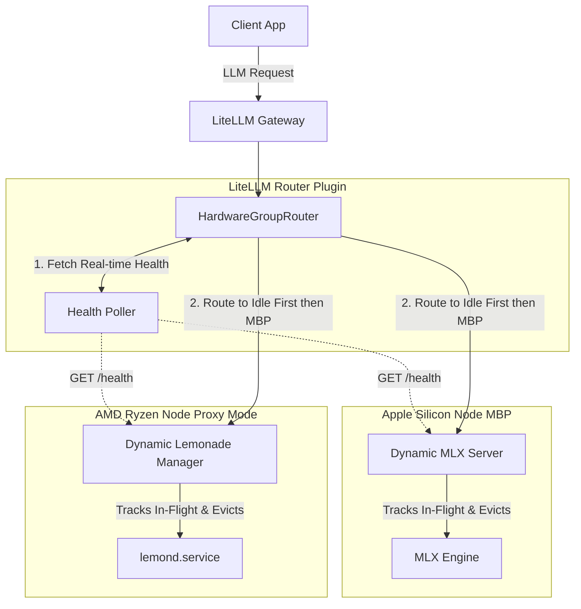

# Cluster Routing & Node Management Reinforcement Plan

This document outlines the analysis, recommendations, and technical implementation plan to fulfill the project goals for the Turnstone cluster.

## 1. Analysis of Current Cluster Customizations

**`hardware_group_router_litellm.py` (Router)**
- **Current State:** Relies on a local, statically-tracked `WeightedRequestTracker`. It blindly assumes a node's load based on what *it* has sent, without knowing the actual memory state, what model is loaded, or if the node is processing traffic from other sources.
- **Flaws:**
  - Can overload a node (OOM risk) if the local tracker goes out of sync with actual node state.
  - If all nodes exceed capacity limits, it falls back to routing to the "least loaded" node anyway, which guarantees an OOM or massive performance penalty if the node is genuinely maxed out.
  - Prioritizes static packing (filling up the MBP first) over utilizing truly idle nodes.

**`dynamic_lemonade_manager.py` (Ryzen Node Watchdog)**
- **Current State:** Operates as a sidecar checking systemd logs and `/v1/health`. Evicts models based on a static `last_use` timestamp or if multiple heavy models are detected in memory.
- **Flaws:**
  - Evicts models mid-generation. Because it only checks `last_use` (updated at request start) and does not intercept traffic in `watchdog` mode, a long-running request will hit the `IDLE_TTL_SECONDS` threshold and be killed while actively processing.
  - Resolves heavy model conflicts (e.g., Qwen + Gemma) by evicting the older one, without checking if the older one is currently generating tokens.

**`dynamic_mlx_server.py` (Apple Silicon Node)**
- **Current State:** Tracks `last_active_time` natively when requests hit `/v1/chat/completions`.
- **Flaws:**
  - Suffers from the exact same premature eviction bug. A 4-minute generation will be evicted at the 3-minute TTL mark because `last_active_time` is only set once when the request *starts*.

## 2. Recommendations & Best Practices

1. **Real-time Health Polling in Router:** The router must fetch `/health` synchronously during the routing decision to get the *true* state of the nodes (active requests, loaded models, memory).
2. **Strict Capacity Rejection:** If no node has the capacity to safely run a model (or if a heavy model conflict exists on active nodes), the router must return an empty list. This triggers LiteLLM's retry/queue mechanism instead of forcing a crash.
3. **True Idle Prioritization:** The router must first look for nodes with `active_requests == 0`. Only if no completely idle nodes exist should it fall back to packing requests onto active nodes (still respecting the MBP -> Ryzen priority order).
4. **Mandatory Proxy Mode for Lemonade:** The Ryzen manager must run exclusively in `proxy` mode. By proxying the traffic, it can wrap requests in an `in_flight_requests` counter, guaranteeing it never evicts a model that is generating.
5. **In-Flight Tracking for MLX:** Add an `in_flight_requests` counter to the MLX server to protect active generation from the idle TTL reaper.

## 3. Architecture & Interaction Diagram

## User Review Required

> [!WARNING]
> **Synchronous Health Checks:** Polling `/health` across the network during the routing decision adds ~20-50ms of latency to the start of every request. We determined this is worth the trade-off for 100% accurate memory protection.

> [!IMPORTANT]
> **Proxy Mode Shift:** `dynamic_lemonade_manager.py` will have `watchdog` mode deprecated in favor of `proxy` mode to guarantee request tracking. You will need to ensure LiteLLM is pointing to the Manager's port (13306) rather than directly to `lemond` (13305).

## Proposed Changes

---

### LiteLLM Router
Modifications to implement real-time health checks, idle-first routing, and strict capacity enforcement.

#### [MODIFY] [`hardware_group_router_litellm.py`](file:///home/teqonix/nerd_projects/turnstone-teqonix/.github/issues/bare_metal_migration/litellm/hardware_group_router_litellm.py)
- Replace `WeightedRequestTracker` with a real-time `NodeHealthPoller` that fetches `/health` using `aiohttp` or `httpx` synchronously during `run()`.
- Implement `active_requests` parsing to identify truly idle nodes.
- Update routing logic:
  1. Filter nodes by memory capacity and heavy-model mutual exclusion.
  2. If any eligible node has `active_requests == 0`, pick the highest priority one.
  3. Otherwise, pick the highest priority eligible node with capacity.
  4. If no nodes are eligible, return `[]` to trigger LiteLLM queueing.

---

### Ryzen Node Manager
Modifications to enforce proxy mode and track in-flight requests.

#### [MODIFY] [`dynamic_lemonade_manager.py`](file:///home/teqonix/nerd_projects/turnstone-teqonix/.github/issues/bare_metal_migration/ryzen_node_custom/dynamic_lemonade_manager.py)
- Enforce `proxy` mode as the standard operating mode.
- Add an `in_flight_requests: int = 0` counter to `LemonadeLifecycleManager`.
- In `proxy_or_handle`, increment `in_flight_requests` before proxying, and decrement it in a `finally` block.
- Update `idle_cleanup_loop` to only evict if `in_flight_requests == 0` AND the TTL has expired.
- Expose `in_flight_requests` in the `/health` endpoint for the Router to consume.

---

### MLX Node Server
Modifications to protect active requests from premature eviction.

#### [MODIFY] [`dynamic_mlx_server.py`](file:///home/teqonix/nerd_projects/turnstone-teqonix/.github/issues/bare_metal_migration/mlx_node_custom/dynamic_mlx_server.py)
- Add an `in_flight_requests: int = 0` counter to `DynamicMLXManager`.
- In `chat_completions`, increment `in_flight_requests` at the start, and decrement it in the `finally` block (ensure stream generators also correctly decrement when exhausted or closed).
- Update `idle_cleanup_loop` to only evict if `in_flight_requests == 0` AND the TTL has expired.
- Expose `in_flight_requests` in the `/health` endpoint for the Router to consume.

---

### Documentation
Update the main project documentation to reflect the new proxy-based hardware-level load balancing architecture.

#### [MODIFY] [`README.md`](file:///home/teqonix/nerd_projects/turnstone-teqonix/README.md)
- Add a new section detailing the transition to a custom proxy (`dynamic_lemonade_manager.py` in proxy mode).
- Explain that LiteLLM and Turnstone natively only support model-level load balancing, necessitating this hardware-level load balancer to track true in-flight requests and memory states.

## Verification Plan

### Automated Tests
I will create a standalone python test script in the `scratch/` directory that uses `httpx` and `asyncio` to:
1. Spin up the MLX Server and Lemonade Manager locally on different ports.
2. Mock the LiteLLM Router's health check functions.
3. Simulate a long-running request (e.g., 4 minutes) and verify that the TTL background task does *not* evict the model while it's running.
4. Verify that once the request finishes, the model is evicted after the TTL.
5. Simulate the Router's decision matrix to prove it selects Idle nodes first, prioritizes the MBP when loaded, and returns empty candidates when maxed out.
