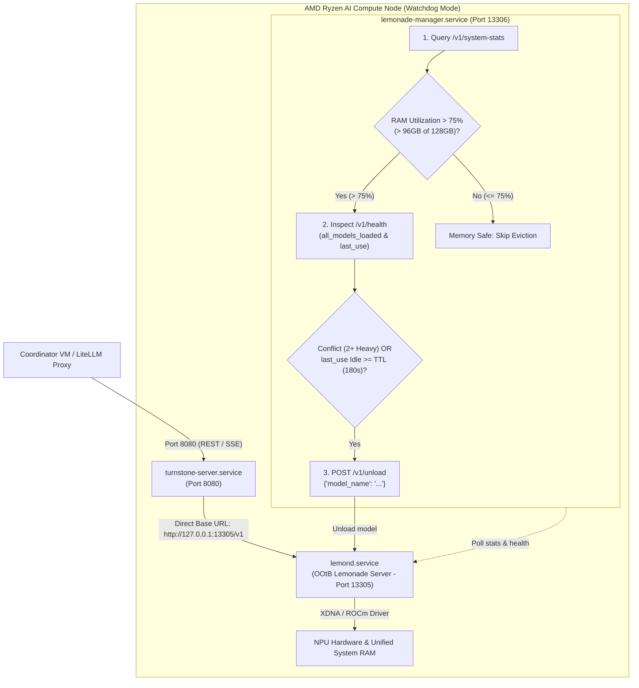

# Turnstone Dynamic Lemonade Manager Sidecar (AMD Ryzen AI Halo)

`dynamic_lemonade_manager.py` is an asynchronous residency, memory reclamation, and supervisor sidecar designed for AMD Ryzen AI Halo bare-metal nodes (`amd-ai-core-one.lan`, `amd-ai-core-two.lan`).

It supports two operational deployment modes:
1. **`watchdog` (Default & Recommended)**: An out-of-band observer that monitors `lemond.service` directly on port `13305`. Turnstone Server connects straight to `lemond.service`, while the watchdog continuously inspects memory pressure (`/v1/system-stats`), tracks loaded in-memory models (`/v1/health`), and evicts idle or conflicting heavy models (`POST /v1/unload`).
2. **`proxy` (Opt-In)**: An inline reverse proxy on port `13306` that intercepts inference requests to execute instant lazy eviction before requests reach `lemond.service`.

---

## 1. Architecture & Watchdog Control Flow



---

## 2. Port & Process Topology

| Service | Binary / Environment | Default Port | Description |
| :--- | :--- | :--- | :--- |
| **`lemond.service`** | `/usr/bin/lemond` (System C++ daemon) | `13305` (HTTP)<br/>`9000` (WS) | OOtB Lemonade Server provided by the OS image. Executes GGUF models on NPU / CPU. |
| **`lemonade-manager.service`** | `/opt/lemonade-manager-venv/bin/python3` | `13306` | Python FastAPI sidecar running in `watchdog` (or `proxy`) mode. Serves `/health` & `/status`. |
| **`turnstone-server.service`** | `/opt/turnstone-venv/bin/turnstone-server` | `8080` | Bare-metal Turnstone node daemon registering back to Coordinator VM and PostgreSQL. |

---

## 3. Core Mechanisms

### A. Memory Utilization Gating (`/v1/system-stats`)
- Queries `GET /v1/system-stats` on every poll interval (default: 60s).
- Computes current RAM percentage relative to total node memory (`NODE_TOTAL_RAM_GB`, default: 128 GB).
- **Safe Window**: If memory utilization is $\le 75\%$ ($\le 96\text{ GB}$), the watchdog logs memory as safe and skips eviction, allowing models to stay pre-warmed in memory.
- **Dangerous Condition**: If memory utilization exceeds $75\%$ ($> 96\text{ GB}$), the watchdog inspects in-memory models.

### B. In-Memory Residency Discovery (`/v1/health`)
- Discovers active models from the `all_models_loaded` list returned by `GET /v1/health` (rather than `/v1/models` which lists all available models on disk).
- Tracks model metadata: `model_name`, `checkpoint`, `last_use` timestamp, `pid`, and heavy model family (`gemma`, `qwen`).
- Observes transitions of `last_use`: when `last_use` is unchanged across polling intervals under memory pressure, elapsed idle time increases.

### C. Native Model Eviction (`POST /v1/unload`)
- When an idle heavy model reaches `LEMONADE_IDLE_TTL_SECONDS` (default: 180s) or when multiple heavy model families conflict under memory pressure, the sidecar sends a standard unload request:
  ```http
  POST /v1/unload HTTP/1.1
  Host: 127.0.0.1:13305
  Content-Type: application/json

  {"model_name": "gemma-4-31B-it-GGUF-UD-Q4_K_XL"}
  ```

---

## 4. Configuration & Environment Variables

| Variable | Default Value | Description |
| :--- | :--- | :--- |
| `LEMONADE_MANAGER_MODE` | `watchdog` | Deployment mode: `watchdog` (out-of-band observer) or `proxy` (inline reverse proxy). |
| `LEMONADE_BACKEND_URL` | `http://127.0.0.1:13305` | Address where `lemond.service` is running. |
| `LEMONADE_WATCHDOG_POLL_INTERVAL_SECONDS` | `60` | Polling frequency for watchdog inspections (in seconds). |
| `LEMONADE_IDLE_TTL_SECONDS` | `180` | Seconds before an idle heavy model is unloaded under memory pressure. |
| `NODE_TOTAL_RAM_GB` | `128.0` | Total physical RAM on the compute node (in GB). |
| `LEMONADE_MEMORY_THRESHOLD_PERCENT` | `75.0` | RAM threshold percentage (75% = 96GB) above which eviction triggers. |
| `PORT` | `13306` | Port the manager sidecar listens on. |
| `HOST` | `0.0.0.0` | Bind address for the manager sidecar. |

---

## 5. Operations & Verification

### Check Live Sidecar Status & Health
```bash
curl -s http://127.0.0.1:13306/health | jq .
```
Example Output:
```json
{
  "status": "healthy",
  "manager_mode": "watchdog",
  "lemond_backend": "http://127.0.0.1:13305",
  "lemond_status": {
    "systemd_active": true,
    "backend_reachable": true,
    "backend_url": "http://127.0.0.1:13305"
  },
  "system_memory": {
    "total_ram_gb": 128.0,
    "threshold_percent": 75.0,
    "threshold_gb": 96.0,
    "latest_stats": {
      "cpu_percent": 12.3,
      "memory_gb": 8.4,
      "gpu_percent": 45.0,
      "vram_gb": 2.1,
      "npu_percent": null
    }
  },
  "watchdog_poll_interval_seconds": 60,
  "idle_ttl_seconds": 180,
  "last_poll_status": "Memory Safe: 8.4GB / 128GB (6.6% <= 75% threshold). Eviction skipped.",
  "all_models_loaded": {
    "gemma-4-31B-it-GGUF-UD-Q4_K_XL": {
      "family": "gemma",
      "pid": 176611,
      "last_use": 187270816,
      "idle_seconds": 120
    }
  },
  "recent_evictions": []
}
```

### Manual Model Unload via Lemonade
```bash
curl -X POST http://127.0.0.1:13305/v1/unload \
  -H "Content-Type: application/json" \
  -d '{"model_name": "gemma-4-31B-it-GGUF-UD-Q4_K_XL"}'
```
